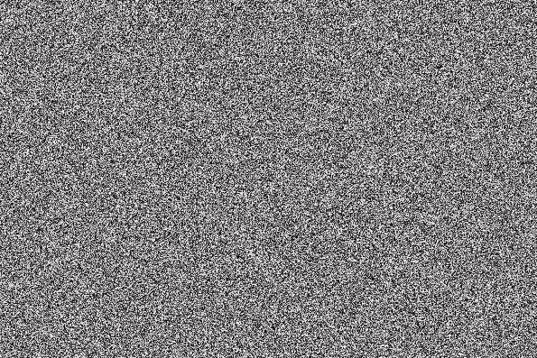
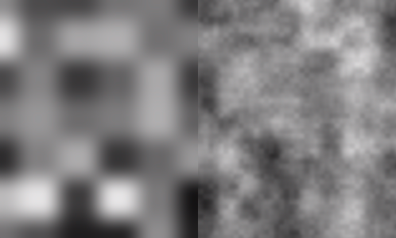
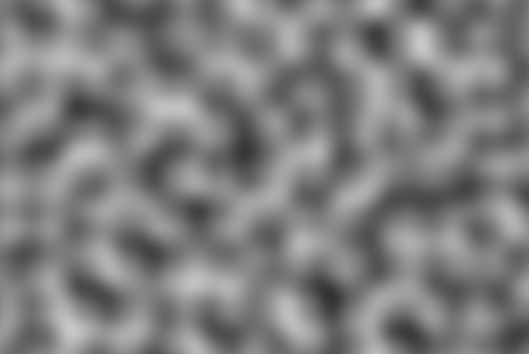
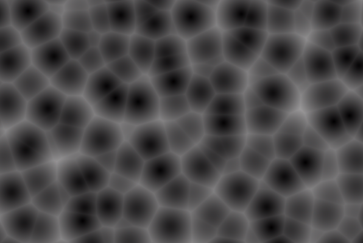
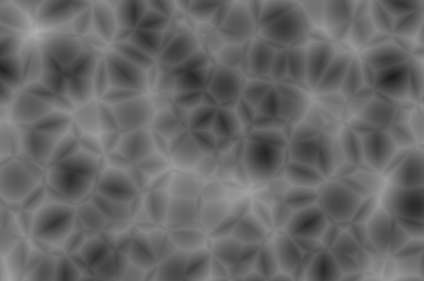
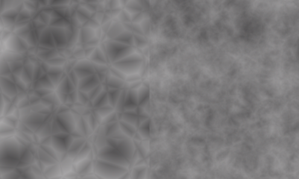
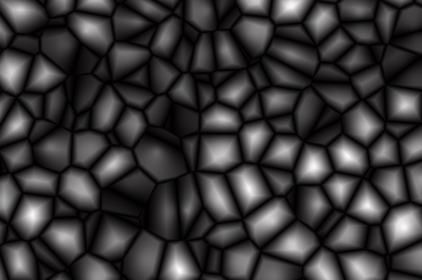

# PNoise.jl

Procedural Noise functions in julia!
All functions are implemented in 1D to 4D, and normalized to a range of [0, 1]. 

We have:
### Random Noise

### Value Noise

### Perlin Noise

### Worley Noise
The function returns the distances to the 8 nearest points in the grid. 
Distance to the closest point (F1):

Distance to the second closest point (F2):

Distance to the 4th-closest point (F2):

2*(F2 - F1):

### TODO
Simplex Noise
Simulation noises for divergence-free flow fields: [Simulation Noise](https://en.wikipedia.org/wiki/Simulation_noise)

