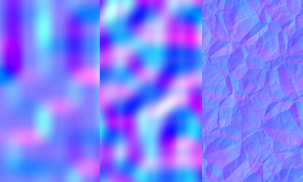
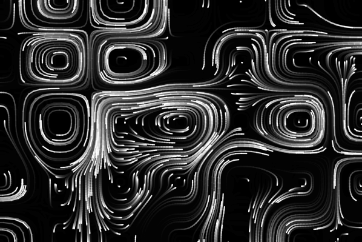

# ProceduralNoise.jl

Procedural Noise functions in julia!

## Procedural Noise

Several noise functions are implemented for 1 to 4 dimensions. All outputs are normalized to a range of [0, 1]. 

### Fractal Noise
The `fractal` function can be used to add up multiple scaled octaves of the given noise function to create fractal noise. 
```julia
fractal(perlin_noise, x, y, z)

# nr_octaves: how many values to sum up
# persistence: amplitude factor, how much do successive octaves contribute
# lacunarity: frequency factor, how much does frequency increase with octaves
fractal(value_noise, x, y, nr_octaves=Val(3), persistence=0.4, lacunarity=2.1)
```

### Random Noise
```julia
random_noise(x, y, z)
fractal(random_noise, x, y, z)
```


### Value Noise [⤷](https://en.wikipedia.org/wiki/Value_noise)
```julia
value_noise(x, y)
fractal(value_noise, x, y)
```


### Perlin Noise [⤷](https://en.wikipedia.org/wiki/Perlin_noise)

```julia
perlin_noise(x, y, z, w)
fractal(perlin_noise, x, y, z, w)
```


### Worley Noise [⤷](https://en.wikipedia.org/wiki/Worley_noise)
Also known as Voronoi Noise or Cellular Noise. Returns the distance to the $k$-th nearest point in the Voronoi diagram. Specific functions exist for each value of $k$. `worley_noise1(x)` returns the distance to the closest point in the voronoi diagram, `worley_noise2` the distance to the 2nd-closest, up to `worley_noise8`, which gives the distance to the 8th-closest point. 
By default, all values are scaled down to be in the range of [0,1]. This behaviour can be controlled with the `normalize` kwarg. With `normalize=false` the functions will return the raw euclidian distances. 

For convenience, get all 8 values as a tuple using `worley_noise`. 
```julia
w1, w2, w3, w4, w5, w6, w7, w8 = worley_noise(x, y, z)
w7 == worley_noise7(x, y, z)
```

```julia
worley_noise1(x, y, normalize=true)
fractal(worley_noise1, x, y)
```


```julia
worley_noise4(x, y)
fractal(worley_noise4, x, y)
```


```julia
2 * (worley_noise2(x, y) - worley_noise1(x, y))
2 * (fractal(worley_noise2, x, y) - fractal(worley_noise1, x, y))
```


## Gradients

Gradients can be obtained for `value_noise`, `perlin_noise` and `worley_noise` functions. `fractal` noise is also supported. All gradients are calculated analytically. 
```julia
dx, dy, dz = value_noise(x, y, z, gradient=true)
dx, dy = perlin_noise(x, y, gradient=true)
dx, dy, dz, dw = fractal(worley_noise2, x, y, z, w, gradient=true)
```


## Divergence-Free Vector Field Noise

### Simulation Noise [⤷](https://en.wikipedia.org/wiki/Simulation_noise)

Simulation Noise can be used to generate divergence-free, 2D and 3D, flow fields. The functions can take an additional parameter to vary the flow field over time. 

```julia
(fx, fy) = sim_noise2d(x, y)
(fx, fy) = sim_noise2d(x, y, t)
(fx, fy) = fractal(sim_noise2d, x, y)
(fx, fy) = fractal(sim_noise2d, x, y, t)
```


```julia
(fx, fy, fz) = sim_noise3d(x, y, z)
(fx, fy, fz) = sim_noise3d(x, y, z, t)
(fx, fy, fz) = fractal(sim_noise3d, x, y, z)
(fx, fy, fz) = fractal(sim_noise3d, x, y, z, t)
```

### Curl Noise
```julia
(fx, fy, fz) = curl_noise(x, y, z)
(fx, fy, fz) = curl_noise(x, y, z, t, f=value_noise)
(fx, fy, fz) = fractal(curl_noise, x, y, z)
(fx, fy, fz) = fractal(curl_noise, x, y, z, t)
```

### Bitangent Noise
```julia
(fx, fy, fz) = bitangent_noise(x, y, z)
(fx, fy, fz) = bitangent_noise(x, y, z, t)
(fx, fy, fz) = fractal(bitangent_noise, x, y, z)
(fx, fy, fz) = fractal(bitangent_noise, x, y, z, t)
```


##### TODO
Simplex Noise

performance tipps section
